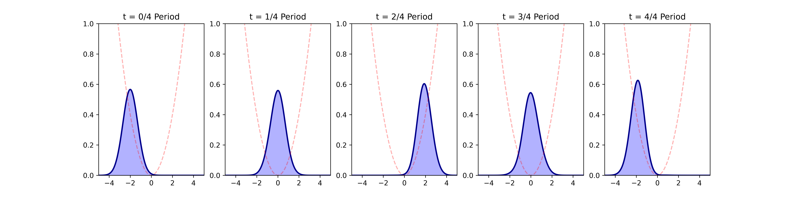

# QuantumOscillatorPINN

This repository implements a **Physics-Informed Neural Network (PINN)** to solve the 1D Time-Dependent Schrödinger Equation (TDSE) for a **Quantum Harmonic Oscillator (QHO)**. Unlike traditional numerical solvers (like Finite Difference or Split-Step Fourier), this model uses **Automatic Differentiation** to satisfy physical laws directly within the neural network's loss function.

---

## The Physics Problem

We simulate a particle trapped in a quadratic potential $V(x) = \frac{1}{2}x^2$. The system is governed by the Scaled Schrödinger Equation:

$$i \frac{\partial \psi}{\partial t} = -\frac{1}{2} \frac{\partial^2 \psi}{\partial x^2} + V(x)\psi$$


### The "Coherent State" Experiment
We initialize the system with a **Gaussian Wave Packet** (Coherent State) shifted to $x = -2.0$. In a harmonic potential, the laws of quantum mechanics dictate that this packet should oscillate back and forth like a classical pendulum **without changing its shape or dispersing**.

---

## Model Architecture

### Neural Network Design
- **Inputs:** 2 (Space $x$, Time $t$)
- **Outputs:** 2 (Real part $u$, Imaginary part $v$, where $\psi = u + iv$)
- **Layers:** 4 hidden layers, 128 neurons each.
- **Activation:** `Tanh` (Selected for its smooth higher-order derivatives required for the Laplacian $\nabla^2$).

### Multi-Objective Loss Function
To ensure physical accuracy, the total loss is a weighted sum of:
1.  **Initial Condition Loss ($L_{IC}$):** Matches the starting Gaussian packet at $t=0$.
2.  **Boundary Condition Loss ($L_{BC}$):** Forces $\psi \to 0$ at $x = \pm 5$.
3.  **Physics Residual Loss ($L_{PDE}$):** Penalizes violations of the Schrödinger Equation across the domain.
4.  **Normalization Loss ($L_{Norm}$):** Enforces $\int |\psi|^2 dx = 1$.

---

## Optimization Strategy

Physics-informed models are notoriously "stiff" to train. This project uses a **Two-Stage Optimization** approach:

1.  **Stage 1 (Adam):** 5,000 iterations to find the global neighborhood of the solution and capture the general wave motion.
2.  **Stage 2 (L-BFGS):** A second-order optimizer used to refine the physics residuals to high precision ($< 10^{-6}$), ensuring the wave maintains its shape throughout the $2\pi$ cycle.

---
### Visualizations

*Figure 1: Evolution of the probability density over one full period of oscillation.*
---
## Installation

```bash
# Clone the repository
https://github.com/chelihi-motaki-errahmane/QuantumOscillatorPINN.git

# Install dependencies
pip install torch numpy matplotlib
